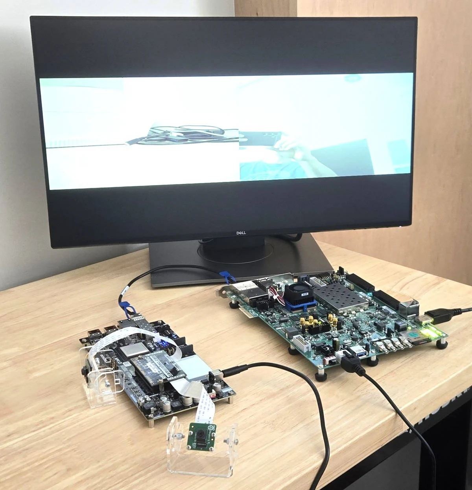

# MIPI over Chip2Chip

## Description

This project connects MIPI CSI-2 cameras that are attached to a **processor-less FPGA board**
to a **Zynq UltraScale+ host** running Linux, using [AXI Chip2Chip] over an [Aurora 64B/66B]
serial link on an SFP+ cable. The host sees the remote video pipelines as ordinary
memory-mapped peripherals, and the captured frames are written straight into the host's
DDR memory.

It is the proof-of-concept of a **universal MIPI CSI-2 FMC**: an FMC card with its own
FPGA. The MIPI D-PHY pins of the AMD MIPI CSI-2 RX subsystem have to land on particular
pins (DBC/QBC byte groups), which the VITA 57.1 FMC standard does not constrain — so a
conventional MIPI FMC can only be pin-matched to one or two carriers. Putting the camera
pipelines on a small FPGA *on the mezzanine* fixes the MIPI pin assignment there, and the
interface to the carrier becomes a generic serial link that almost any FPGA board can
provide. As a bonus, the video pipelines no longer consume resources on the main device:
one 1080p capture pipeline in this design costs about 11.6k LUTs, 15.5k flip-flops,
30 block RAM tiles and 41 DSPs.

Here the roles are played by off-the-shelf hardware: the main board is an AMD ZCU106, and
a Tria AUBoard 15P carrying the Opsero [RPi Camera FMC] (OP068) stands in for the
mezzanine card.

It is therefore a **two-board system**. Unlike most Opsero reference designs, the two
target designs of this repository are not alternatives to choose from: they are the two
halves of one system, and both must be built.

| Role      | Target design | Board | What it does |
|-----------|---------------|-------|--------------|
| Host      | `zcu106`      | AMD [ZCU106] (Zynq UltraScale+) | Runs Linux (AMD EDF / Yocto). Controls the remote video pipelines and receives the frames in its DDR memory. |
| Mezzanine | `auboard`     | Tria [AUBoard 15P] (Artix UltraScale+, no processor) | Carries the Opsero [RPi Camera FMC] (OP068) with two Raspberry Pi cameras, and holds the MIPI CSI-2 video pipelines. |



Important links:
* The [documentation](https://mipi-over-chip2chip.camerafmc.com/en/latest/) of this reference design
* The RPi Camera FMC [datasheet](https://docs.opsero.com/op068/datasheet/overview/)
* To [report an issue](https://github.com/fpgadeveloper/mipi-over-chip2chip/issues)
* For technical support: [Contact Opsero](https://opsero.com/contact-us)

## Architecture

```
          AUBoard 15P  (xcau15p, no processor)                 ZCU106  (xczu7ev, Linux)
 +---------------------------------------------+     +---------------------------------------+
 |  RPi Camera FMC (OP068) on the FMC slot     |     |                                       |
 |                                             |     |                                       |
 |  CAM0 =MIPI=> [ pipeline 0 ] =AXI4=+        |     |         +--------+      +--------+    |
 |  CAM2 =MIPI=> [ pipeline 2 ] =AXI4=+        |     |         |  APU   |======|  DDR4  |    |
 |                     ^              |        |     |         +--------+      +--------+    |
 |          AXI4-Lite  |              v  AXI4  |     |             |                ^        |
 |         (registers) |        +-----------+  |     |       regs  v                | DMA    |
 |                     +--------|  AXI      |  |     |        +------------------------+     |
 |                              | Chip2Chip |  |     |        |    AXI Chip2Chip       |     |
 |                              |  MASTER   |  |     |        |    SLAVE               |     |
 |                              +-----+-----+  |     |        +-----------+------------+     |
 |                                    |        |     |                    |                  |
 |                              +-----+-----+  |     |              +-----+-----+            |
 |                              |  Aurora   |  |     |              |  Aurora   |            |
 |                              |  64B/66B  |  |     |              |  64B/66B  |            |
 |                              +-----+-----+  |     |              +-----+-----+            |
 +------------------------------------|--------+     +--------------------|------------------+
                                  SFP+ cage                            SFP0 cage
                                      |                                   |
                                      +====== SFP+ DAC cable ==============+
                                        1 lane, Aurora 64B/66B, 10.3125 Gb/s
```

* The **AUBoard 15P** has no processor, neither hard nor soft. It contains one MIPI CSI-2
  capture pipeline per camera (`CAM0` and `CAM2` of the RPi Camera FMC) and its end of the
  chip-to-chip link. It is the AXI Chip2Chip **master**: its AXI4-Lite *master* port drives
  the local peripherals with register accesses that arrive from the host, and its AXI4
  *slave* port carries the frame writes towards the host.
* The **ZCU106** is the AXI Chip2Chip **slave**. It controls every register of the remote
  pipelines through a 16 MB window at `0xA000_0000`, exactly as if the IP were in its own
  programmable logic.
* The frame buffer writes of the remote pipelines travel back over the same link and land in
  the low 2 GB of the DDR memory of the ZCU106, where Linux picks the frames up as ordinary
  V4L2 capture buffers.
* The link is a single SFP+ direct attach cable between the `SFP0` cage of the ZCU106 and
  the SFP+ cage of the AUBoard 15P.

Measured on hardware: both cameras stream 1920x1080 RGB24 at the sensor's maximum
47.57 frames/s at the same time — **591.8 MB/s through the link, with no dropped frames**.
See [Using the cameras from Linux](https://mipi-over-chip2chip.camerafmc.com/en/latest/linux_cameras.html).

The host image brings the two remote cameras up **by itself at boot** and can put them side
by side on a monitor plugged into the ZCU106's DisplayPort socket — see
[Showing the cameras on a DisplayPort monitor](https://mipi-over-chip2chip.camerafmc.com/en/latest/display.html). The same hardware
also runs a **bare-metal** demo on the A53, without an operating system — see
[Bare-metal demo](https://mipi-over-chip2chip.camerafmc.com/en/latest/baremetal.html).

## Requirements

This project is designed for version 2025.2 of the AMD tools. The Linux image of the host
is built with the AMD Embedded Development Framework (EDF) Yocto flow: there is **no
PetaLinux project** in this repository. The host also has a bare-metal Vitis application;
the processor-less mezzanine has no software at all.

To build and test the design you will need:

* Vivado 2025.2 and Vitis 2025.2 (Vitis provides `sdtgen`/`xsct`, which the Yocto flow uses,
  and it builds the bare-metal application)
* A Linux build PC for the Yocto image (the Vivado and the bare-metal builds also run on
  Windows)
* 1x AMD [ZCU106] Evaluation board
* 1x Tria [AUBoard 15P] FPGA Development board
* 1x Opsero [RPi Camera FMC] (OP068)
* 2x [Raspberry Pi Camera Module 2], connected to `CAM0` and `CAM2`
* 1x SFP+ direct attach (DAC) cable
* A USB-JTAG and a USB-UART connection to each board, and an Ethernet connection to the
  ZCU106 for the Linux work
* *Optional:* a DisplayPort monitor and cable for the ZCU106, to see the two camera streams

> **FMC voltage (VADJ).** The RPi Camera FMC is specified for a VADJ of **1.2 V**. On the
> AUBoard 15P, the board definition file describes jumper `J46` as setting VCCO of banks 66
> and 86 — the banks of the FMC connector — to 1.8 V (high, the board default) or 1.2 V
> (low). Opsero runs this bench, and the `auboard` target of the
> [rpi-camera-fmc](https://github.com/fpgadeveloper/rpi-camera-fmc) reference design, at the
> board's 1.8 V setting without any observed issue. The design uses 1.2 V-compatible I/O
> standards in either case.

## Target designs

<!-- updater start -->
| Target board          | Target design   | Role      | Device           | Connector | Cameras | Baremetal<br> App | PetaLinux<br> Build | Yocto<br> Build | Vivado<br> Edition | IP<br>License |
|-----------------------|-----------------|-----------|------------------|-----------|---------|-------|-------|-------|-------|-------|
| [ZCU106]              | `zcu106`        | host      | Zynq UltraScale+ | SFP0      | 2       | :white_check_mark: | :x:                | :white_check_mark: | Standard :free: | -     |
| [AUBoard 15P]         | `auboard`       | mezzanine | FPGA             | HPC       | 2       | :x:                | :x:                | :x:                | Standard :free: | -     |

[ZCU106]: https://www.xilinx.com/zcu106
[AUBoard 15P]: https://www.avnet.com/americas/products/avnet-boards/avnet-board-families/auboard-15p-fpga-development-kit/
<!-- updater end -->

Notes:
1. Both target designs are needed: `zcu106` is the host and `auboard` is the mezzanine of
   the same system.
2. The Connector column is the connector each design uses on its own board: the `SFP0` cage
   of the ZCU106 carries the link, and the FMC connector of the AUBoard 15P carries the
   RPi Camera FMC (the AUBoard's own SFP+ cage carries the other end of the link).
3. The Vivado Edition column indicates which designs are supported by the Vivado *Standard*
   Edition, the FREE edition which can be used without a license.
4. The `auboard` target design has video pipelines for 2 cameras: `CAM0` and `CAM2` as
   labelled on the RPi Camera FMC.
5. The `auboard` target has no processor, so it has no software build: its products are the
   bitstream and the configuration memory file (`.mcs`) that the board boots from.

The table above is generated from `config/data.json` by `python3 config/update.py`. Do not
edit the block between the `updater` tags by hand — change the manifest and re-run the
updater.

## Build instructions

Clone the repo and change into its directory:
```
git clone --recursive https://github.com/fpgadeveloper/mipi-over-chip2chip.git
cd mipi-over-chip2chip
```

The `--recursive` flag pulls in `submodules/avnet-bdf`, the board definition files of the
AUBoard 15P (they are not in the AMD board store). The build runner also initialises a
missing submodule by itself.

All builds are driven by `build.py` at the repo root, on both Windows (git bash) and Linux.
The `build.sh` / `build.bat` shim finds a suitable Python 3 automatically, and the runner
locates the AMD tools in their standard install locations, so there is no need to source
the tool settings first. Each command builds whatever it depends on and skips anything that
is already built. On Windows without git bash, use `build.bat` with the same arguments.

#### Build the bitstreams (Vivado)

```
./build.sh xsa --target zcu106
./build.sh xsa --target auboard
```

Each command creates the Vivado project, runs synthesis and implementation and exports the
hardware to `Vivado/<target>/c2c_wrapper.xsa`. The bitstream of the processor-less `auboard`
target is `Vivado/auboard/auboard.runs/impl_1/c2c_wrapper.bit` (it is also contained in the
XSA). Timing and utilization reports are written to `Vivado/<target>/reports/`, and the
timing result is printed in the build log (`Vivado/logs/<target>_xsa.log`) on a line that
starts with `TIMING:`.

#### Build the Linux image of the host (Yocto, Linux only)

```
./build.sh yocto --target zcu106
```

See [Yocto/README.md](Yocto/README.md) for the prerequisites and for the instructions to
write the image to an SD card, and [Deploying and updating the Linux image](https://mipi-over-chip2chip.camerafmc.com/en/latest/deploy.html) for a
first deployment onto a board whose SD card you cannot reach.

#### Build the bare-metal application of the host (Vivado + Vitis, Windows or Linux)

```
./build.sh standalone --target zcu106
```

This builds the Vitis platform, the standalone BSP, the `cam_test` application and
`Vitis/boot/zcu106/BOOT.BIN`. It needs no PetaLinux and no Linux build host. See
[Bare-metal demo](https://mipi-over-chip2chip.camerafmc.com/en/latest/baremetal.html).

#### Build the configuration memory file of the mezzanine

```
./build.sh cfgmem --target auboard
```

This wraps the `auboard` bitstream into `Vivado/auboard/c2c_wrapper.mcs`, which
`scripts/jtag/auboard_flash.tcl` writes into the board's configuration flash — see
[Booting the AUBoard from its configuration flash](https://mipi-over-chip2chip.camerafmc.com/en/latest/flash.html). The `auboard` target has no processor and no
software, so `./build.sh all --target auboard` builds the bitstream, this `.mcs`, and
gathers both into `bootimages/mipi-over-chip2chip_auboard_bitstream-2025-2.zip`.

#### Other commands

```
./build.sh list                       # the targets of this repo
./build.sh status --target all        # what has been built
./build.sh all --target all           # build everything that each target supports
./build.sh clean --target <target>    # delete the generated outputs of a target
```

## Bringing the system up

1. Fit the RPi Camera FMC on the AUBoard 15P with cameras on `CAM0` and `CAM2`, connect the
   SFP+ DAC cable between the ZCU106 `SFP0` cage and the AUBoard SFP+ cage, and power both
   boards.
2. **Load the design into the AUBoard.** Do this once, into the board's configuration
   flash: the AUBoard has no boot mode switch — it always boots from that flash — and once
   the design is in there it configures itself about 1.5 to 2 seconds after power-on, with
   no JTAG cable and no operator, and the link trains by itself from there. Start a
   `hw_server`, then:
   ```
   ./build.sh cfgmem --target auboard
   vivado -mode batch -nolog -nojournal -notrace \
     -source scripts/jtag/auboard_flash.tcl \
     -tclargs Vivado/auboard/c2c_wrapper.mcs -verify -cable <pattern>
   ```
   Then power-cycle the board. `-cable` is a substring of the JTAG cable name; it keeps the
   script off the other boards on the same `hw_server`. Programming the flash destroys the
   image the board shipped with, so back it up first — see
   [Booting the AUBoard from its configuration flash](https://mipi-over-chip2chip.camerafmc.com/en/latest/flash.html) for that, for the Vivado Hardware Manager
   GUI procedure, and for how to undo it.

   **The volatile alternative** is to program the FPGA over JTAG, which is what you want
   while you are iterating on the mezzanine design:
   ```
   vivado -mode batch -nolog -nojournal -notrace \
     -source scripts/jtag/auboard_prog.tcl \
     -tclargs Vivado/auboard/auboard.runs/impl_1/c2c_wrapper.bit -cable <pattern>
   ```
   Nothing is written to the configuration flash, so the design is lost at the next power
   cycle and the board comes back with whatever is in its flash. A JTAG load always
   overrides the flash image until the next power cycle, so the two are not exclusive: keep
   a known-good image in the flash and still iterate over JTAG.
3. **Check the link** from the AUBoard, without any software:
   ```
   vivado -mode batch -nolog -nojournal -notrace \
     -source scripts/jtag/auboard_axi.tcl -tclargs status -cable <pattern>
   ```
   This decodes the link status bits and prints the measured Aurora user clock. `LED4` is
   the Aurora `channel_up` and `LED3` is the AXI Chip2Chip link status, so the link state is
   also visible on the board.
4. **Boot the ZCU106** from its SD card. Its FSBL programs the PL out of `BOOT.BIN`, so the
   host end of the link is live before Linux starts. From Linux:
   ```
   sudo c2c-link-status          # must report: link: UP  (status 0x0000000F)
   ```
5. **Use the cameras.** Nothing has to be done: `c2c-cameras.service` waits for the link,
   applies the device-tree overlay and configures both pipelines at boot.
   ```
   sudo c2c-cameras status       # service state : ready   /   health : OK
   v4l2-ctl -d /dev/video-cam0 --stream-mmap=4 --stream-count=60 --stream-to=/tmp/cam0.rgb
   ```
   See [Using the cameras from Linux](https://mipi-over-chip2chip.camerafmc.com/en/latest/linux_cameras.html) — including the manual
   overlay procedure, the stable device names and the retry
   (`systemctl restart c2c-cameras`).
6. *Optional:* **put both cameras on a DisplayPort monitor** attached to the ZCU106. The
   display is off by default:
   ```
   sudo c2c-display check        # read-only: connector, EDID, planes, mixer registers
   sudo c2c-display              # both cameras, 960x540 each, side by side
   ```
   See [Showing the cameras on a DisplayPort monitor](https://mipi-over-chip2chip.camerafmc.com/en/latest/display.html).

The ZCU106 can also be brought up over JTAG without any software at all
(`scripts/jtag/zcu106_init.tcl` programs the PL and runs `psu_init`,
`scripts/jtag/zcu106_mem.tcl` reads and writes the memory map); and the camera pipelines can
be exercised from the AUBoard alone with `scripts/jtag/auboard_cam.tcl`. See the
[build instructions](https://mipi-over-chip2chip.camerafmc.com/en/latest/build_instructions.html) for the full list of subcommands.

## Documentation

The full documentation is hosted at [mipi-over-chip2chip.camerafmc.com/en/latest](https://mipi-over-chip2chip.camerafmc.com/en/latest/)
and is best viewed from there. It is built with Sphinx from the sources in `docs/source/`:

| Page | Content |
|------|---------|
| [Description](https://mipi-over-chip2chip.camerafmc.com/en/latest/description.html) | the architecture of both block designs, the display path, address map, interrupts, clocks, measured performance |
| [Requirements](https://mipi-over-chip2chip.camerafmc.com/en/latest/requirements.html) | tools and hardware |
| [Supported boards](https://mipi-over-chip2chip.camerafmc.com/en/latest/supported_carriers.html) | the boards of each role |
| [Build instructions](https://mipi-over-chip2chip.camerafmc.com/en/latest/build_instructions.html) | Vivado, Yocto, bare metal, and the JTAG bring-up scripts |
| [Yocto](https://mipi-over-chip2chip.camerafmc.com/en/latest/yocto.html) | the AMD EDF flow of the host image |
| [Deploying and updating the Linux image](https://mipi-over-chip2chip.camerafmc.com/en/latest/deploy.html) | SD card, first deployment without a card reader, updates |
| [Booting the AUBoard from its configuration flash](https://mipi-over-chip2chip.camerafmc.com/en/latest/flash.html) | making the mezzanine design permanent: backup, `.mcs`, programming, timing, going back |
| [Using the cameras from Linux](https://mipi-over-chip2chip.camerafmc.com/en/latest/linux_cameras.html) | the auto-start service, the health check, stable device names, formats, capture, picture quality, frame rates |
| [Showing the cameras on a DisplayPort monitor](https://mipi-over-chip2chip.camerafmc.com/en/latest/display.html) | the display path, `c2c-display`, and how to prove the picture arrived without a monitor |
| [Bare-metal demo](https://mipi-over-chip2chip.camerafmc.com/en/latest/baremetal.html) | the Vitis SDT flow with a User DTS, `cam_test`, running it over JTAG and dumping a frame |
| [Advanced](https://mipi-over-chip2chip.camerafmc.com/en/latest/advanced.html) | changing the line rate, adding cameras, porting to another host board |
| [Troubleshooting](https://mipi-over-chip2chip.camerafmc.com/en/latest/troubleshooting.html) | link, register access, image, display and build problems |

`docs/link_contract_deviations.md` is the authoritative record of every parameter that the
two block designs must agree on, and of every place where one of them deviates.

## Repository layout

```
mipi-over-chip2chip/
├── build.py, build.sh, build.bat  cross-platform build runner
├── config/data.json               the manifest: both target designs and their attributes
├── config/update.py               regenerates the README table, build.tcl and .gitignore
├── Vivado/
│   ├── scripts/                   build.tcl (project), xsa.tcl (implement + export),
│   │                              cfgmem.tcl (configuration memory file of the AUBoard)
│   └── src/
│       ├── bd/bd_zynqmp.tcl       block design of the host (link + display_pipeline)
│       ├── bd/bd_fpga.tcl         block design of the processor-less mezzanine
│       ├── bd/mipi_locs.tcl       MIPI pin LOCs of the AUBoard 15P
│       ├── constraints/           one .xdc per target
│       └── hdl/                   bit_sync, freq_counter, pipe_gpio
├── Yocto/                         AMD EDF flow, BSP (c2c-tools, c2c-cameras, c2c-display)
│                                  and the device-tree overlay of the remote pipelines
│                                  (Yocto/overlays/)
├── Vitis/                         bare-metal demo of the host: common/src (cam_test),
│                                  common/dts/remote_pipeline.dtsi (the User DTS), py/
├── scripts/jtag/                  JTAG bring-up and test of both boards, no software needed;
│                                  auboard_flash.tcl writes the AUBoard's config flash,
│                                  zcu106_baremetal.tcl runs the bare-metal demo
├── scripts/                       host helpers: filedrop.py, rgb2png.py
├── docs/                          Sphinx documentation
└── submodules/avnet-bdf           board definition files of the AUBoard 15P
```

## Known limitations

* The camera pipelines have **no auto-exposure and no automatic white balance**, and the
  video processing subsystem is built without colour space conversion: the single capture
  format is `RGB3` (`V4L2_PIX_FMT_RGB24`), and exposure, gain and gamma are set by hand.
* The sensor's full resolution, 3280x2464, **exceeds the 1920x1232 maximum** of the video
  IP. The useful IMX219 modes are 1920x1080, 1640x1232 and 640x480.
* The remote frame buffer writers are **32-bit masters** and reach only the low 2 GB of the
  host DDR, so capture buffers must come from the capture driver (MMAP).
* The device tree nodes of the remote peripherals are applied as a **run-time overlay after
  a link check**, once per boot, and cannot be removed: a register access through a link
  that is down never completes.
* A mezzanine that is reset while the host keeps running is **detected and refused**
  (`c2c-cameras health`, exit 5), but the only way back is a **reboot of the host**: the
  remote resets are released in the drivers' `probe` and nowhere else.
* The camera-to-`/dev/videoN` assignment is **not stable across boots** (nor are the
  sensors' I2C bus numbers) — use `/dev/video-cam0` / `/dev/video-cam2`.
* The AUBoard 15P is limited to **two cameras** of the four that the RPi Camera FMC offers.
* The DisplayPort output is **1080p60 only**, and the video mixer's layers cannot
  downscale, so the capture size has to equal the window size (`c2c-display` reconfigures
  the remote scaler for you).
* There is no PetaLinux project: the host's Linux image is the AMD EDF Yocto flow only.

## Contribute

We strongly encourage community contribution to these projects. Please make a pull request if you
would like to share your work:
* if you've spotted and fixed any issues
* if you've added designs for other target platforms
* if you've added software support for other cameras

Thank you to everyone who supports us!

## License

This repository is released under the MIT License — see [LICENSE](LICENSE).

## About us

[Opsero Inc.](https://opsero.com "Opsero Inc.") is a team of FPGA developers delivering FPGA products and
design services to start-ups and tech companies. Follow our blog,
[FPGA Developer](https://www.fpgadeveloper.com "FPGA Developer"), for news, tutorials and
updates on the awesome projects we work on.

[RPi Camera FMC]: https://docs.opsero.com/op068/datasheet/overview/
[Raspberry Pi Camera Module 2]: https://www.raspberrypi.com/products/camera-module-v2/
[AXI Chip2Chip]: https://www.xilinx.com/products/intellectual-property/axi-chip2chip.html
[Aurora 64B/66B]: https://www.xilinx.com/products/intellectual-property/aurora64b66b.html
